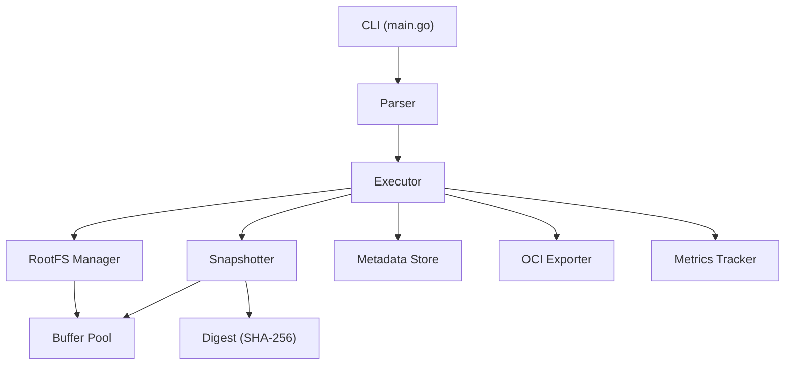

# IMAGIN

**A Docker image builder written from scratch in Go, optimised for p95/p99 tail latency.**

IMAGIN takes a Dockerfile, parses it, executes each instruction against a layered filesystem, snapshots the changes into compressed tar layers, and packages everything into an [OCI Image](https://github.com/opencontainers/image-spec) — the industry standard format that Docker, Podman, and any OCI-compliant tool can use.

---

##  Features

- **Full Dockerfile support** — FROM, RUN, COPY, ADD, ENV, WORKDIR, CMD, ENTRYPOINT, EXPOSE, VOLUME, USER, LABEL, SHELL, ARG, and more
- **Multi-stage builds** — `FROM ... AS builder` + `COPY --from=builder`
- **OCI-compliant output** — produces standard OCI Image Layout directories or single `.tar` files
- **Built-in latency profiling** — p50/p95/p99 percentile breakdown printed after every build
- **Benchmark mode** — run the same build N times for stable percentile statistics
- **Zero-dependency** — no external Go dependencies, pure standard library

---

##  Architecture



| Component | What It Does |
|---|---|
| **Parser** | Lexes and parses Dockerfiles into structured instruction ASTs |
| **Executor** | Orchestrates the build: cache check → rootfs prepare → execute → snapshot → store |
| **RootFS Manager** | Manages layered filesystems (OverlayFS on Linux, copy-fallback on Windows/macOS) |
| **Snapshotter** | Captures filesystem diffs into compressed tar layers with streaming hash+compress |
| **Metadata Store** | Stores image config, layer info, and build cache with lock-free reads |
| **OCI Exporter** | Writes OCI Image Layout directories or tar archives |
| **Metrics Tracker** | Instruments every phase and computes p50/p95/p99 percentiles |

---

## 🚀 Quick Start

### Build the CLI

```bash
go build -o imagin ./cmd/imagin/
```

### Build an image

```bash
# Output as OCI Image Layout directory
./imagin -f Dockerfile -o ./output .

# Output as a single tar file
./imagin -f Dockerfile -o image.tar -format=tar .
```

### See latency breakdown

Every build prints a table like this:

```
✅ Build completed in 1.847s

┌─────────────────────────────────────────────────────────────┐
│                    LATENCY BREAKDOWN                        │
├──────────────────────┬────────┬────────┬────────┬──────────┤
│ Phase                │    Avg │    p50 │    p95 │      p99 │
├──────────────────────┼────────┼────────┼────────┼──────────┤
│ Dockerfile Parse     │  0.2ms │  0.2ms │  0.3ms │    0.4ms │
│ Cache Lookup         │  0.1ms │  0.1ms │  0.2ms │    0.3ms │
│ RootFS Prepare       │ 12.3ms │ 11.8ms │ 18.2ms │   24.1ms │
│ Instruction Execute  │  1.2s  │  1.1s  │  1.6s  │    1.8s  │
│ Layer Snapshot       │ 45.2ms │ 42.1ms │ 68.3ms │   82.7ms │
│   ├─ Diff            │  8.1ms │  7.5ms │ 14.2ms │   18.9ms │
│   ├─ Tar Creation    │ 18.4ms │ 16.9ms │ 28.1ms │   34.2ms │
│   └─ Compression     │ 18.7ms │ 17.7ms │ 26.0ms │   29.6ms │
│ Metadata Store       │  0.3ms │  0.2ms │  0.5ms │    0.8ms │
│ OCI Export           │ 31.5ms │ 29.8ms │ 42.1ms │   51.3ms │
└──────────────────────┴────────┴────────┴────────┴──────────┘

Memory: peak=48MB, allocs=1,247, GC pauses=2 (max 1.2ms)
```

### Benchmark mode

```bash
# Run 100 builds and aggregate percentiles
./imagin -f Dockerfile -o ./output -bench=100 .

# Export raw metrics to JSON
./imagin -f Dockerfile -o ./output -metrics-json=metrics.json .
```

---

##  Latency Optimisations

IMAGIN is designed to minimise **tail latency** (p95/p99), not just average performance. Here's what we do:

| Technique | Where | Impact |
|---|---|---|
| `sync.Pool` buffer reuse | Tar creation, file copy, gzip | Eliminates per-layer allocation → reduces GC pauses |
| Streaming pipeline | Snapshotter | Single-pass: tar → SHA256 → gzip → SHA256 → disk (no intermediate buffering) |
| Pooled gzip writers | Compression | Avoids expensive `gzip.NewWriter` allocation on every layer |
| `sync.Map` for cache | Metadata store | Lock-free reads on the cache lookup hot path |
| `atomic.Value` for config | Metadata store | Lock-free config reads during concurrent access |
| Jump-table dispatch | Executor | O(1) instruction handler lookup via map |
| Pre-allocated slices | Parser, metrics | Token/timing storage pre-sized to avoid slice growth |
| Fixed compression level | Gzip | Eliminates compression-time variance that causes tail spikes |

### Benchmark Results

```
BenchmarkParse-4                 39367          31,183 ns/op     14,760 B/op   118 allocs/op
BenchmarkTrackerStartEnd-4     7924730             148 ns/op         49 B/op     0 allocs/op
BenchmarkCacheLookup-4        10736044             115 ns/op          0 B/op     0 allocs/op
BenchmarkWriteTarLayer-4           403       6,724,420 ns/op    341,958 B/op   138 allocs/op
```

- **Cache lookups**: 0 allocations, 115 ns/op
- **Metrics timing**: 0 allocations on the hot path
- **Tar layer writes**: only 138 allocs for 100 files (pooled buffers)

---

## 📁 Project Structure

```
IMAGIN/
├── cmd/imagin/              # CLI entry point
│   └── main.go
├── pkg/
│   ├── parser/              # Dockerfile lexer + parser
│   ├── executor/            # Build orchestrator + instruction handlers
│   ├── rootfs/              # OverlayFS + fallback filesystem manager
│   ├── snapshotter/         # Layer diff + streaming tar creation
│   ├── metadata/            # Store + config builder + build cache
│   ├── exporter/            # OCI layout + tar exporter
│   ├── metrics/             # Latency tracker + CLI reporter
│   └── pool/                # sync.Pool buffers + streaming pipeline
├── internal/
│   ├── types/               # Shared types and interfaces
│   └── digest/              # Content-addressable SHA-256 hashing
├── testdata/                # Sample Dockerfiles
├── go.mod
└── .gitignore
```

---

##  Running Tests

```bash
# Run all tests
go test ./...

# Run with verbose output
go test -v ./...

# Run benchmarks
go test -bench=. -benchmem github.com/imagin/imagin/pkg/parser github.com/imagin/imagin/pkg/metrics github.com/imagin/imagin/pkg/metadata github.com/imagin/imagin/pkg/snapshotter
```

---

##  Concepts Explained

Here are the key concepts behind each component:

<details>
<summary><b>Dockerfile Parser</b></summary>

A Dockerfile is just text. The parser converts it into structured data:
```
FROM ubuntu:22.04  →  Instruction{Type: FROM, Args: ["ubuntu:22.04"]}
RUN apt-get update →  Instruction{Type: RUN,  Args: ["apt-get update"]}
```
The **lexer** does byte-level scanning (no regex) to produce tokens. The **parser** consumes tokens and groups instructions into build stages.
</details>

<details>
<summary><b>OverlayFS & Copy-on-Write</b></summary>

Container images are **layered**. OverlayFS stacks directories:
```
Base Image         ← lowerdir (read-only)
 + Layer 1         ← lowerdir (read-only)
 + [current step]  ← upperdir (writable)
 = merged view     ← what RUN commands see
```
When you modify a file, only the change goes to the upperdir. Unchanged files aren't copied — that's **Copy-on-Write (CoW)**.
</details>

<details>
<summary><b>Content-Addressable Storage</b></summary>

Every blob (layer, config) is identified by its SHA-256 hash. `sha256:abc123...` is both the name and the integrity check. Two identical layers produce the same hash → stored only once.
</details>

<details>
<summary><b>OCI Image Layout</b></summary>

The standard format: `index.json` → manifest → config + layers. Any OCI-compliant tool (Docker, Podman, skopeo, crane) can read this format.
```
output/
├── oci-layout          # {"imageLayoutVersion": "1.0.0"}
├── index.json          # points to manifest
└── blobs/sha256/       # all content, named by digest
```
</details>

<details>
<summary><b>Why p95/p99 Matters</b></summary>

Average latency hides outliers. If your average build is 2s but 1 in 100 takes 30s, users notice. **p95** = "95% of builds finish within X". We target tails by eliminating allocation storms, GC pauses, and lock contention.
</details>

---

##  Platform Notes

- **Full build execution** (RUN commands, OverlayFS mounts) requires **Linux** with appropriate privileges
- **On Windows/macOS**: parser, metadata, exporter, metrics, and pool packages are fully functional. The executor uses a simulated RUN handler and copy-based rootfs fallback
- Requires **Go 1.22+**

---

## 📄 License

MIT
